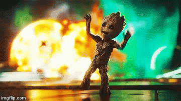

# Infinity Stone Game. 
 
 

Description: This is a game based on the movie, “ Guardians of the Galaxy”. To win, you must match the power of the stone by clicking on the guardians below. Every click of a gaurdians builds upon the current power. If you match the number in the stone, you win! If you go above the power of the infinity stone, then we all lose!
Play the game here [link](https://meganthonykeogh.github.io/Infinity-Stone-Game/)

I was motivated to build this application because I am excited about building games in JavaScript, and I really enjoyed this movie. 

I hope to add more visual effects with JavaScript to make the game more visually interesting to the user. Specifically, I'd like the characters to expand and possibly shoot an object at the stone in the game to make it more apparent that the user has clicked on the character. 

There are no devdependencies or npm packages needed to play this game.

